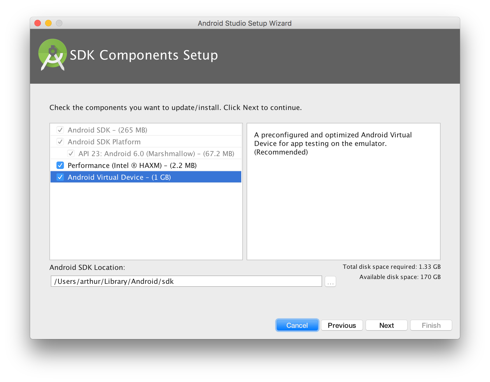
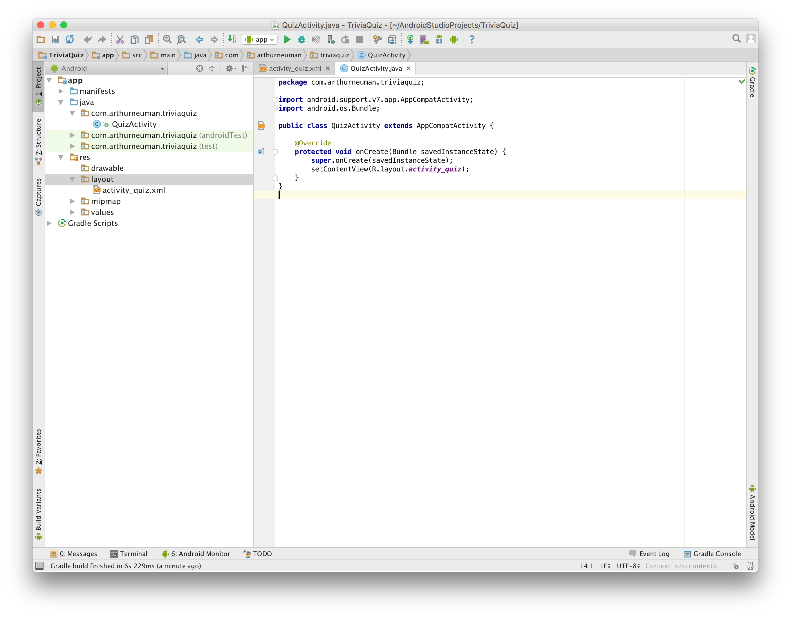

# Week 1 - Android Studio and Material Design

## Corresponding Text
*Android Programming*, pp. xxi-xxii, 1-8, 26-29, 46-48
http://www.google.com/design/spec/material-design/introduction.html

##Android Studio
Android Studio is an integrated development environment (IDE) used to develop
Android applications.  Android Studio is based on the IntelliJ IDEA IDE and
most of Android Studio's features are available as an IntelliJ IDEA plugin.

### Download and Installation
Android Studio requires the Java Development Kit, which can be downloaded from
http://www.oracle.com/technetwork/java/javase/downloads/index.html.

Android Studio can be downloaded from https://developer.android.com/studio. The
Android Studio download page will provide installation instructions, which vary
depending on the operating system of the computer.

### Initial Configuration
After installing Android Studio, there is some initial configuration that must
be done before we can begin writing Android applications.  

When you start Android Studio for the first time, you will be presented with
the *Android Studio Setup Wizard*

Click **Next** to begin the setup process.  We'll use the standard settings;
with **Standard** selected, click **Next**.

On the next page of the setup wizard, we can select SDK components we'd like to
install.  Select all the available components, and click **Next**.

Click **Finish** to begin downloading and installing the SDK components.  When
installation is complete, click **Finish** again.

### Hello World!
The initial steps of developing a new application in Android Studio are similar
to the steps of developing a new application in IntelliJ.  When presented with
the Android Studio welcome screen, select **Start a new Android Studio
project**.

Next, choose an application name, a domain name, and a project location.  
Android Studio will use the domain name to create the appropriate package name.

We can now chose the types of devices that our application will run on and
the minimum version of Android that will be required to run our application.
Choosing a lower API version will allow our app to target more devices but
will prevent us from using newer features.  For now, let's use the default
value and click **Next**.

For our first app, we'll start with an *Empty Activity*.  We'll talk about
activities in detail later; for now, click **Next**.

We can customize the name of the activity to be something like *HelloActivity*.
With **Generate Layout File** selected, click **Finish**.

Android Studio will now generate all the files necessary for our first
application.  Once generation is complete, we'll be presented with a window
that looks very similar to IntelliJ.  We can open the *Project* pane and
examine the project's directory structure.  

Two import files are *HelloActivity.java* and *activity_hello.xml*.  The Java
file contains the code that will be executed when our application is run.  The
XML file contains information about how graphical elements are displayed.  We
will discuss layouts more later.  

Open the layout file by double-clicking on the file.  A graphical preview will
appear.  While we can modify the underlying XML, we can also modify a layout
by using the layout design view.  Our simple layout already has a *TextView*
widget that contains the string "Hello World!".

Though our app doesn't do much, we can run it.  To run the app, click the play
icon in the toolbar.  You should be prompted to choose an emulator or connected
device with which to run your app.  If no connected devices or emulators are
detected, you can create a new emulator.  

It might take a few seconds to a few minutes to start the emulator and load
your application.

To stop the application, either quit the emulator application or click the stop
icon in the the Android Studio toolbar.

## Material Design
