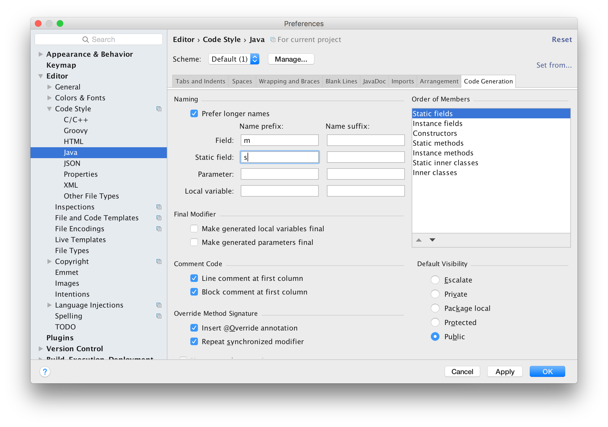
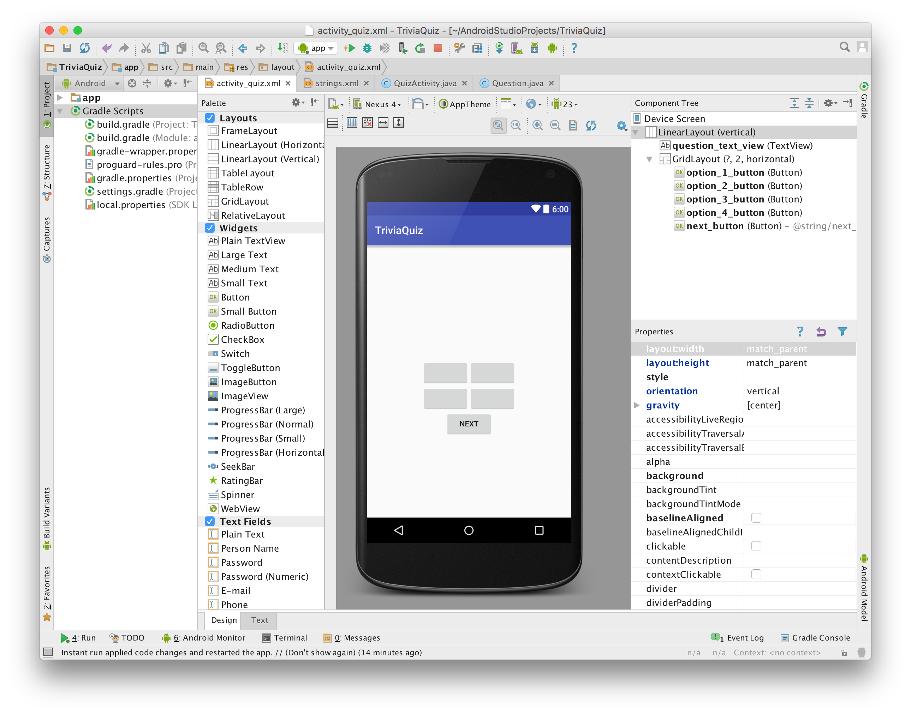

# Week 2 - MVC and Activities

## Corresponding Text
*Android Programming*, pp. 33-46, 57-71

## Adding Functionality
Now that we have a simple app that allows us to quiz a user, we'd like to
expand it beyond a single question.  We'd like to have a collection of
questions we can present to the user.  The first step to doing this is to
create a new class to represent questions - we'll name it *Question*.  With
each question we'll associate question text, four possible answers, and a value
indicating the correct answer.  The question text and possible answers will be
stored as  a string array resource, which we'll look at later, so we'll store
the ID associated with the string array resource.  Our code for the *Question*
class looks like this:

```java
package com.arthurneuman.triviaquiz;

public class Question {
    private int mQuestionResId;
    private int mCorrectAnswer;

    public Question(int questionResId, int correctAnswer) {
        mQuestionResId = questionResId;
        mCorrectAnswer = correctAnswer;
    }

}
```

Notice that instance variables are prefixed with the letter `m`.  By convention
in Android, instance fields are prefixed with the letter `m` and class or
static fields are prefixed with the letter `s`.  While fields have these
prefixes, getters and setters do not.  If we want to automatically generate
getters and setters with Android Studio, we can configure it expect `m`s and
`s`s prefixed to field names.  To do this select **Editor -> Code Style ->
Java** in Android Studio's preferences window, select the **Code Completion**
tab, and type `s` and `m` in the **Name prefix** column and **Field** and
**Static Fields**, respectively.  



We can use Android Studio to generate getters for our fields.  Having set the
code style prevents Android from generating a method name like
*getMQuestionResId*. To generate getters for our fields, right click within
the class body and select **Generate** followed by **Getter**.

Now that we've created a *Question* class to represent each of the questions
our app will present to the user, we'll need to modify *QuizActivity* to make
use of it.  *QuizActivity* will rely on a collection of *Question* instances
that represent question data to determine what is displayed.  Similarly,
*QuestionActivity* will be responsible for handling events that generated by
the interface to determine if a user has chosen a correct answer and to display
a new question.  This separation of the data from the interface with an
intermediary is often referred to as the *Model-View-Controller* pattern.

## Model-View-Controller
In the Model-View-Controller pattern, or MVC, objects in a program are a model
object, a view object, or a controller object.  A **model object** represents
the application's data and data-specific code or "business logic".  A model
object should have no knowledge of the user interface.  Collectively, an
application's model objects make up the **model layer**.  

A **view object** represents everything a user interacts with such as
a *TextView* or a *Button* object. The **view layer** consists of all an
applications view objects.  In our app, the view layers consists of the
the widgets inflated from `activity_quiz.xml`.

**Controller object** tie view and model objects together, controlling the flow
of data between them. The **controller layer** is the collection of controller
objects. Because the code associated with controller objects is often
application-specific, it described as containing the "application logic".  The
*QuizActivity* class represents the TriviaQuiz controller layer.

Using MVC makes it easier to design and keep track of parts of an application.  
We often use classes to group related methods and data; similarly, we can
group similar objects into the model, view, and controller layers based on
their purpose.  In addition to make it easier to understand the function of
various components, separating model code from view code makes it's easier to
reuse objects.  For example, because the *Question* class knows nothing about
how data is displayed on screen, it could be used to display a list of all
questions.  If *Question* were responsible for the interface as well as
question data, we couldn't easily reuse it for different display elements.

### Updating the View and Controller Layers
To accommodate multiple questions, we'll need to update the view layer.  
Currently, we have a *TextView* and four *Button* objects with hard-coded text.  
We'll want to programmatically change the text of these objects, so we can
clear the values of the *text* property for each of them.  We'd also like to
give a more descriptive ID to the *TextView* object; change it to something like
`question_text_view`.  We'll also add a new button that will allow us to move
to the next question.  Place it below the existing buttons and set its *id*
property to `next_button` and it's *text* property to `@string/next_button`; we
won't change the text of this button so it's okay for it to be hard-coded.  

The XML for `activity_quiz.xml` should look similar to this:

```xml
<?xml version="1.0" encoding="utf-8"?>
<LinearLayout xmlns:android="http://schemas.android.com/apk/res/android"
    android:layout_width="match_parent"
    android:layout_height="match_parent"
    android:gravity="center"
    android:orientation="vertical" >

    <TextView
        android:layout_width="wrap_content"
        android:layout_height="wrap_content"
        android:id="@+id/question_text_view"
        android:layout_gravity="center_horizontal"
        android:padding="24dp" />

    <Button
        android:layout_width="fill_parent"
        android:layout_height="wrap_content"
        android:id="@+id/option_1_button"
        android:layout_gravity="center_horizontal" />

    <Button
        android:layout_width="fill_parent"
        android:layout_height="wrap_content"
        android:id="@+id/option_2_button"
        android:layout_gravity="center_horizontal" />

    <Button
        android:layout_width="fill_parent"
        android:layout_height="wrap_content"
        android:id="@+id/option_3_button"
        android:layout_gravity="center_horizontal" />

    <Button
        android:layout_width="fill_parent"
        android:layout_height="wrap_content"
        android:id="@+id/option_4_button"
        android:layout_gravity="center_horizontal" />

    <Button
        android:layout_width="wrap_content"
        android:layout_height="wrap_content"
        android:text="@string/next_button"
        android:id="@+id/button"
        android:layout_gravity="center_horizontal"/>
</LinearLayout>
```

We'll have to update the string resource file to include the text for the
next button.  We can also additional questions.  We'll store our questions and
their associated options as string array resources.  Like a string resource, a
string array must have a name.  To add elements to the string array, we can use
the *item* tag where the content of the tag is an element in the array.  A
string array for our the options of our existing question looks like this:

```xml
<string-array name="question_1">
    <item>What is the capital of Washington?</item>
    <item>Seattle</item>
    <item>Tacoma</item>
    <item>Olympia</item>
    <item>Spokane</item>
</string-array>
```

Feel free to add as few or as many questions as you'd like. The `strings.xml`
resource file should looks like this:

```xml
<resources>
    <string name="app_name">TriviaQuiz</string>
    <string name="toast_correct">Correct!</string>
    <string name="toast_incorrect">Incorrect</string>
    <string name="next_button">Next</string>
    <string-array name="question_1">
        <item>What is the capital of Washington?</item>
        <item>Seattle</item>
        <item>Tacoma</item>
        <item>Olympia</item>
        <item>Spokane</item>
    </string-array>
    <string-array name="question_2">
        <item>What is the largest planet in the solar system?</item>
        <item>The Sun</item>
        <item>Earth</item>
        <item>Jupiter</item>
        <item>The Moon</item>
    </string-array>
    <string-array name="options_3">
        <item>What is 2+2?</item>
        <item>4</item>
        <item>22</item>
        <item>0</item>
        <item>1</item>
    </string-array>
</resources>
```

At this point, the design view of the interface will look similar to the
following.



Next, we can update the controller layer, *QuizActivity*, to display questions
and handle user interaction.

Let's add a *Question* array to store our questions and initialize it with
three instances, once for each question. We can store this as a field.


## Activities
### Activity Lifecycle
### Demonstration of the Activity Lifecycle
### Rotation
### Saving Data
