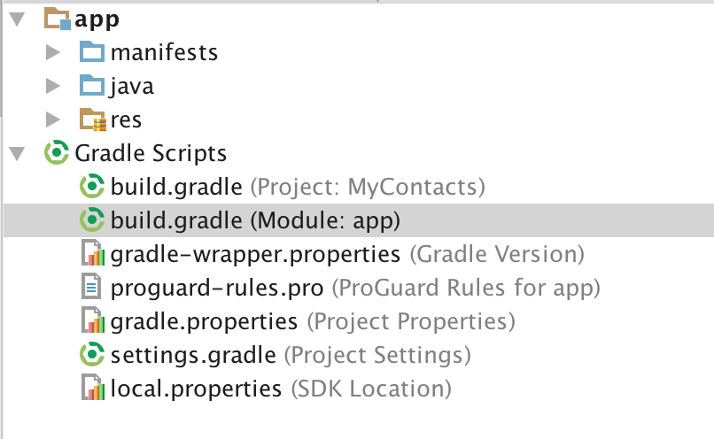
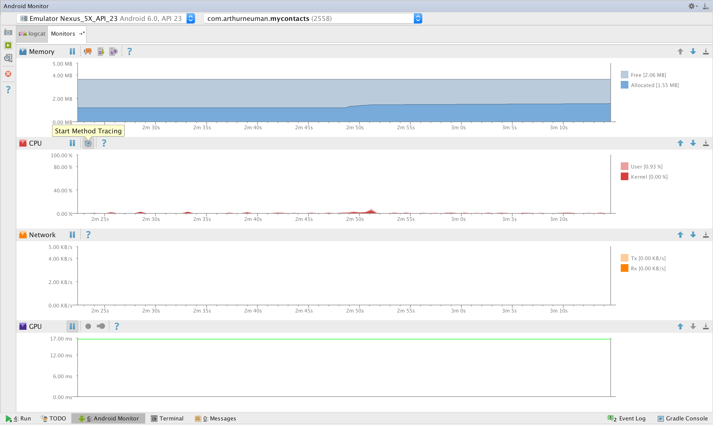

# Week 5 - Unit Tests and Profiling

## Corresponding Text
http://developer.android.com/training/testing/unit-testing/index.html
http://developer.android.com/tools/performance/index.html

## Unit Tests
While it might seem reasonable to manually test features of an app while the 
app is relatively small, as we add features manual testing becomes 
time-consuming and prone to error.  Ideally, we should automate our testing 
whenever possible.

**Unit tests** verify the functionality of a small piece of code: a method, a 
class, or some other component.  For example, if we have a class representing 
contact information that stores a name and email address, we might want to test 
the ability to assign a name and email address and the ability to retrieve 
these values.  

We can create and automate unit tests for our apps.  There are two types of 
unit tests that we can create: local tests and instrumented tests.  Local tests 
don't depend on the Android framework or instrumentation information.  Local 
tests can be run locally on the JVM.  Testing something like a class to store 
contact information would likely make use of local tests. Instrumented tests 
are unit tests that require an Android device or emulator to run. For example, 
if we wanted to test our apps ability to start another activity, we might 
create an instrumented test. If we'd like to test some code that depends on the 
Android framework, we also have the option of using local tests if we **mock**
the components of Android that we need. A mocked object is an object created 
to simulate the behavior of another object.  For example, we might want to 
test some functionality that depends on a *Bundle*; rather than write an 
instrumented test, we can write a local test if we mock *Bundle*.

### Setup
We're going to focus on local tests.  To create and run our tests, we'll make 
use of two testing frameworks: JUnit and Mockito.  This will require that we 
explicitly indicate to the build system, Gradle, that our project depends on 
these frameworks.  To do this, we'll modify the module's `build.gradle` file.



The dependencies section should look similar to this:

```
dependencies {
    compile fileTree(dir: 'libs', include: ['*.jar'])
    androidTestCompile('com.android.support.test.espresso:espresso-core:2.2.2', {
        exclude group: 'com.android.support', module: 'support-annotations'
    })
    compile 'com.android.support:appcompat-v7:25.0.1'
    testCompile 'junit:junit:4.12'
}
```

Notice that there's already an entry for JUnit.  Let's add an entry for 
Mockito. The dependencies section should now looks like this:

```
dependencies {
    compile fileTree(dir: 'libs', include: ['*.jar'])
    androidTestCompile('com.android.support.test.espresso:espresso-core:2.2.2', {
        exclude group: 'com.android.support', module: 'support-annotations'
    })
    compile 'com.android.support:appcompat-v7:25.0.1'
    testCompile 'junit:junit:4.12'
    testCompile 'org.mockito:mockito-core:1.10.19'
}
```

Once the additional dependency is added, you should be prompted to sync Gradle.

### Creating Tests
When viewing the structure of our app in the Android view, we can see three 
different packages, one that contains the classes we've created for our app and 
two that contain test classes.


If we view the structure as a typical Java project, we can see that these three 
different packages are located in different folders within the `src` folder.


We'll add our local tests to the `test` folder and instrumented tests to the 
`androidTest` folder.  

Notice that there is a simple example of each kind of test in each folder. 
Let's add a local test.

Right-click on the test package/folder and select **New** and **Java Class**. 
Name the new class `ContactTest`.  Let's start by first importing a couple of 
classes:

```Java
import org.junit.Test;
import static org.junit.Assert.assertTrue;
```

The `org.junit.Test` class will be used as a decorator to indicated that a 
method represents a test.  `assertTrue` will be used to determine if the 
test passes or fails.  We can define a test of the getters and setters of 
the *Contact* class so that our entire `ContactTest.java` file looks like this:

```java
public class ContactTest {
    @Test
    public void contactAccessorTest() {
        String name = "Test Name";
        String email = "name@test.com";
        Contact contact = new Contact();
        contact.setName(name);
        contact.setEmail(email);
        assertTrue((contact.getName().equals(name)
                && contact.getEmail().equals(email)));
    }
}
```

In the *ContactTest* class we define one test: *contactAccessorTest()*.  In the 
test we set two strings, one for a name and one for an email address. Next, we 
create a new instance of the *Contact* class and set the name and email fields 
using the appropriate setters.  Finally, we use `assertTrue` to test that 
the getters return the values we supplied to the setters - this is the expected 
behavior.  

To run the test, we can either right-click on the `ContactTest.java` file and 
select **Run 'ContactTest'** or right-click on the "test" folder and select 
**Run 'Tests in 'mycontacts''**.  In either case, if the tests pass, we should 
see a message indicating that the tests passed.

Let's change the *contactAccessorTest()* method so that the last line is 

```java
assertTrue((contact.getName().equals(email)
        && contact.getEmail().equals(name)));
```

We'll see a message indicating that a test failed and an **AssertionError** 
indicating exactly which test failed.

Let's add one more test to ensure that newly created instances of *Contact* 
have non-null IDs:

```java
    @Test
    public void UUIDcreationTest() {
        Contact contact = new Contact();
        assertNotNull(contact.getID());
    }
```

If *Contact* had more complex functionality, we could define additional tests 
to verify that *Contact* behaved in the expected manner.


### Mocking Android Dependencies
By default, when we run our tests, they are executed with a modified version 
of the `android.jar` file that normally contains code for the Android 
framework.  The modified version will throw an exception when we attempt to 
use any Android classes or methods - this ensures we are testing our code and 
not implicitly relying on Android functionality. However, some of our code 
will be tightly coupled to the Android framework and will require certain 
Android classes to test.

As a somewhat trivial example, suppose *ContactActivity* includes a method 
for getting the package name from a *Context* object:

```java
    public String getPackage(Context context) {
        return context.getPackageName();
    }
```

Suppose we wanted to test this.  Because it depends on *Context*, a class 
from the Android framework, the test would fail with an exception if we wrote 
it like our previous test.  Instead, we have to mock the *Context* class.  By 
mocking it, we have to define its methods' behaved as necessary.  Specifically,
we'll need to define behavior for *Context.getPackageName()*.

Here's the complete test class:

```java
@RunWith(MockitoJUnitRunner.class)
public class ContactActivityTest {
    private static final String PACKAGE_NAME = "com.test.mycontacts";
    @Mock
    Context mContext;

    @Test
    public void contactFragmentCreationTest() {
        when(mContext.getPackageName()).thenReturn(PACKAGE_NAME);
        ContactActivity contactActivity = new ContactActivity();
        String packageName = contactActivity.getPackage(mContext);
        assertEquals(PACKAGE_NAME, packageName);
    }
}

```

First, we have to annotate our class with `@RunWith(MockitoJUnitRunner.class)`. 
Next, we specify the Android classes we'll mock using the the `@Mock` 
annotation. We define the behavior of the mocked objects using the 
`when(...).thenReturn(...)` construction to specify the return value when a 
specific method is called.  In the example, we then create an instance of 
*ContactActivity* and call the *getPackage()* method with the mocked 
context.  If things behave as expected, the value returned by 
*ContactActivity.getPackage()* should be the same as the value returned by 
the *Context*, which we defined.  This trivial example would throw an exception 
if we didn't create a mocked *Context* class. 

## Profiling 
Users expect apps to start quickly and be responsive.  As we develop the app it 
will be important to not only test functionality using unit test but to also 
examine performance using the profiling tools included with Android Studio.

### Performance Monitors
Android Studio includes a collection of tools we can use to monitor resource 
usage of app.  These tools are available in the **Android Monitor** view. 
We've already used one of the monitors, *logcat*, when viewing log messages.


Next to the **logcat** tab, we can find the **Monitors** tab.  There are four 
charts that are displayed providing information about usage over time:

- Memory
- CPU
- Network
- GPU



Each chart has a set of tools available for use.  The memory chart shows our 
app's memory usage over time.  In adddition to being able to track the usage,
we can also use the monitor to dump the heap, where all runtime data is stored, 
to what is consuming memory; track memory allocations of objects; and force 
the garbage collector to run. A common problem, especially when using media, is 
consuming more memory than is available leading to a crash.  The memory monitor 
and it's tools can help determine what is consuming large amounts of memory.

The CPU monitor displays the app's processor usage.  Additionally, we can track 
method execution using the method tracer tool.  The CPU monitor is useful if we 
notice that the app is frequently unresponsive. We might have several 
long-running methods in different threads or a lot of short-running threads.  

The network monitor is useful for tracking network usage.  If we find that our 
app is transmitting or receiving more data than we expect, it might be due to a 
bug.  Given that a lot of users have limited bandwidth, it's important that we 
track down excessive usage.  Similarly, if we expect to connect to an external 
data source and don't appear the be getting/sending data, we can confirm this 
using the network monitor.

The GPU monitor indicates the time required to render the apps interface. 
Unless the app makes use of advanced graphics, we shouldn't expect rendering to 
take a lot of time.  If we have a lot of UI elements, we might see this 
reflected in the GPU monitor. 

To demonstrate a memory leak, consider the following example adapted from 
[Codexpedia.com](http://www.codexpedia.com/android/memory-leak-examples-and-solutions-in-android/). 
First, create a new app with an empty activity.  Update the activity to include 
the following code:

```java
public class MainActivity extends AppCompatActivity {
    private Handler mLeakyHandler = new Handler();
    private int[] mValues = new int[5 * 1024 * 1024];

    @Override
    protected void onCreate(Bundle savedInstanceState) {
        super.onCreate(savedInstanceState);

        // Post a message and delay its execution for 10 seconds.
        mLeakyHandler.postDelayed(new Runnable() {
            @Override
            public void run() {
                Toast.makeText(MainActivity.this, 
                        "Number of items: " + mValues.length, 
                        Toast.LENGTH_LONG)
                .show();
            }
        }, 1000 * 10);
    }
```

Here, we are making use of a *Handler*.  A *Handler* lets us add a *Message*, a 
special object to store data, or a *Runnable* to a queue as well as process 
objects in the queue.  A *Handler* will allow us to create threads that can 
interact with the UI. Here, we add a *Runnable* that displays a message about 
the size of the *mValues* array.  Because the new thread requires information 
about *mValues*, a reference to the object is maintained until the activity is 
destroyed and the thread has executed.  

Now start the app and rotate the device a few times.  Eventually, the app 
should crash.  If we view the log messages using **logcat**, we can see that 
the app crashed due to a lack of memory.  If we restart the app and use the 
memory monitor while rotating the app, we can see that the app slowly consumes 
more and more memory until it crashes.


If we wanted to gain more insight into what was using memory, we could track 
memory allocation by clicking the **Start Allocation Tracking** button.  Once 
the app crashes, click the button again to see what the memory allocation 
looked like - we should see multiple *int* arrays consuming large amounts of 
RAM.  


Though this example exaggerates the issue by initializing a large array , 
the way the code is written is still causing a memory leak - when the activity 
is destroyed, due to rotation or something else, the *Handler* queue is not 
cleared; this can be done by adding the following to the 
*MainActivity.onDestroy()* method:

```java
    mLeakyHandler.removeCallbacksAndMessages(null);
```